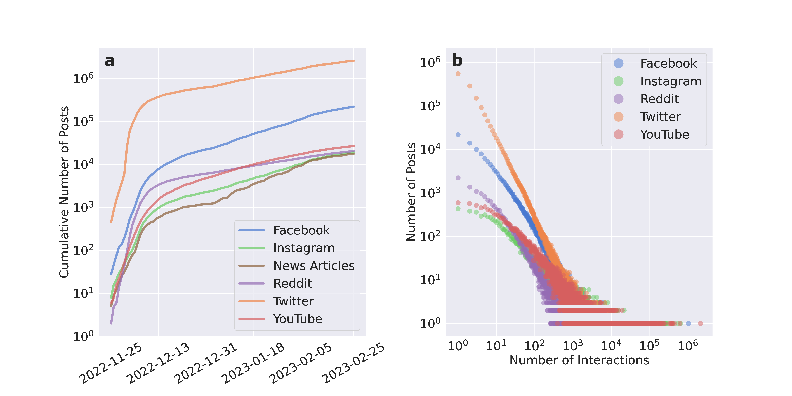
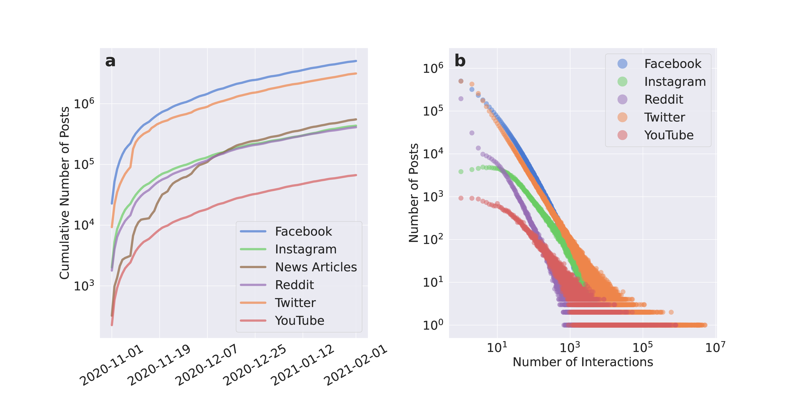
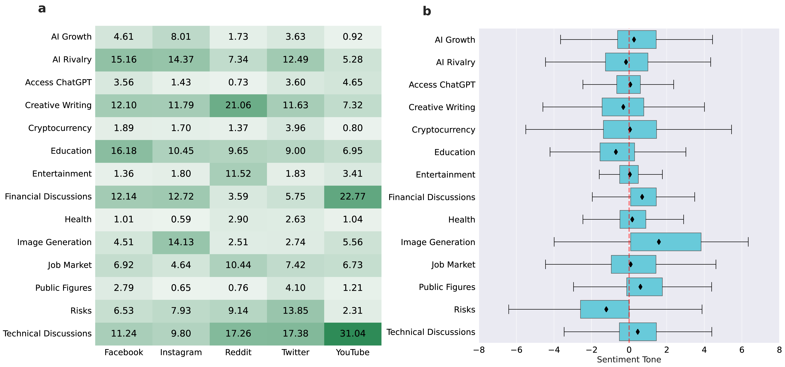

In paper “Cross-Platform Social Dynamics: An Analysis of ChatGPT and COVID-19 Vaccine Conversations” we analyzed how discussions about Large Language Models spread on multiple platforms, and how it compares to the diffusion pattern of COVID-19 vaccination debates. 


## ChatGPT and vaccination discussions in online platforms
We gathered over 12 million posts and articles from Twitter, Facebook, Instagram, Reddit, YouTube, and GDELT (news outlets) for both topics during a 3-month period. 

#### ChatGPT discussions
<div style="width: 100%; position: relative; margin: 0 auto;">
    <div style="padding-top: 50%; position: relative;">
        
    </div>
</div>

#### COVID-19 vaccination discussions
<div style="width: 100%; position: relative; margin: 0 auto;">
    <div style="padding-top: 50%; position: relative;">
        
    </div>
</div>


## Platform-specific dynamics
Using topic modeling techniques for discussions related to LLMs, we discovered that each platform has a distinct thematic emphasis, reflecting its specific features and audience. Furthermore, by doing sentiment analysis we highlighted a diverse range of public perceptions regarding these topics. 

<div style="width: 100%; position: relative; margin: 0 auto;">
    <div style="padding-top: 50%; position: relative;">
        
    </div>
</div>

## Modeling user engagement growth
In the end, we modeled the user engagement for each topic-platform and found unique patterns across platforms for the same topic. When we compared diffusion patterns of ChatGPT and COVID-19 vaccination discussions, we observed a faster spreading pace for the latter.

<div style="width: 100%; position: relative; margin: 0 auto;">
    <div style="padding-top: 65%; position: relative;">
        
    </div>
</div>

## Citation
```
@misc{alipour2023crossplatform,
      title={Cross-Platform Social Dynamics: An Analysis of ChatGPT and COVID-19 Vaccine Conversations}, 
      author={Shayan Alipour and Alessandro Galeazzi and Emanuele Sangiorgio and Michele Avalle and Ljubisa Bojic and Matteo Cinelli and Walter Quattrociocchi},
      year={2023},
      eprint={2310.11116},
      archivePrefix={arXiv},
      primaryClass={cs.CY}
}
```